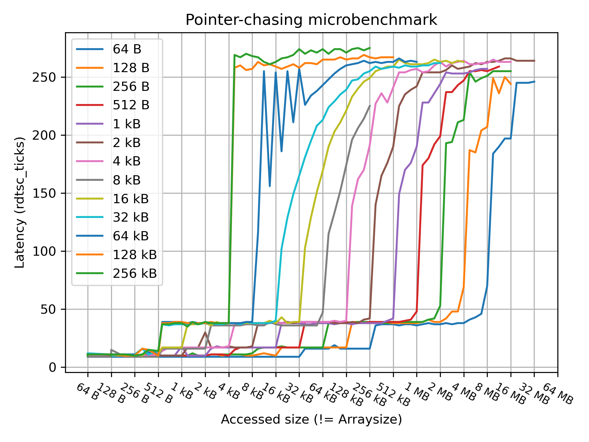

# LBP 20-21 Group-7

## Topic
Analysis and reverse-engineering of (selected) hardware components in moderns systems and their security implications

## Directory structure 

- `pc.c` - The main pointer chasing code for reverse engineering cache sizes in C language
- `pc.py` - The runner script in python, to run pc.c with different experimental settings, to get result statistics
- `plot.py` - The code for making different plots, and visualization
- `util.h` - Some helpful utilities


## Steps For Execution
1. Download the repository zip file and extract or clone as:-
```
    git clone https://github.com/kssuraaj28/hw-reverse.git
``` 
2. In the cloned repository folder,type the following command (Linux OS - You need 1GB of free RAM for this):-
```
    sudo sysctl vm.nr_hugepages=512
```
3.  Run the make file using the following command:-
```
    make
```
4. Run the pyhton script as:-
```
    python3 pc.py
```
5. After execution is finished,reset the hugepages to 0 like:-
```
    sudo sysctl vm.nr_hugepages=0
``` 
## Results


